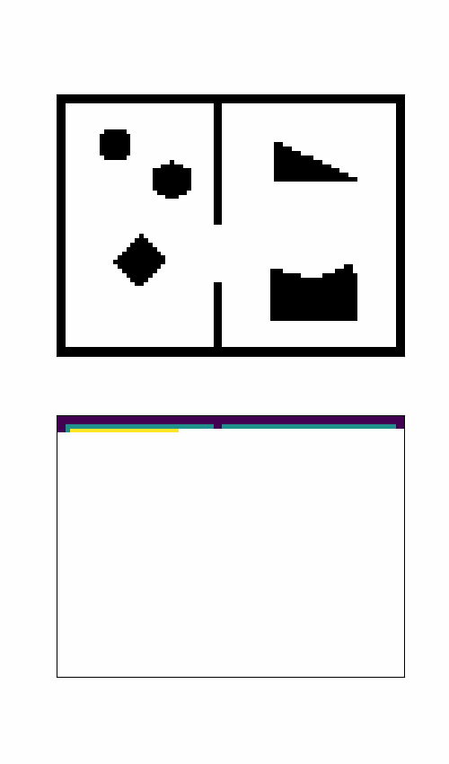
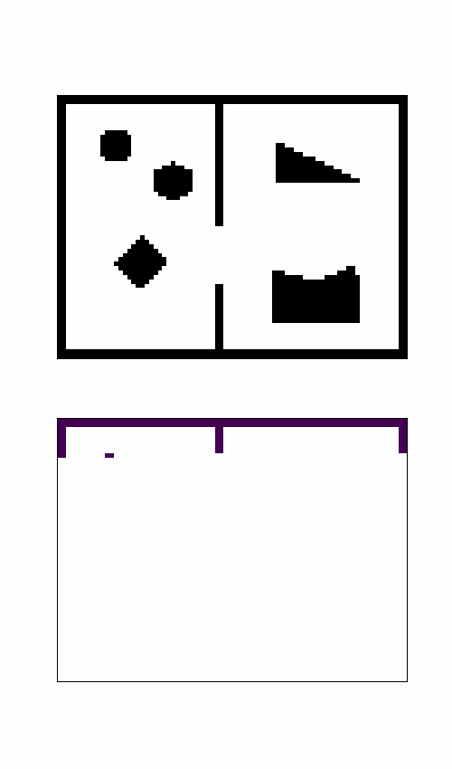

# ESDF Demo

## Contents

1. [Brute-Force (Any distance)](#1)
2. [Forward BFS (L1 distance)](#2)
3. [Backward BFS (L1 & L2 distance)](#3)
4. [Sweep Dynamic Programming (L1 distance)](#4)
5. [Distance Transform of Sample Functions (Any distance)](#5)
6. [Incremental Backward BFS (Any distance)](#6)

## 1. Brute-Force (Any distance)

## 2. Forward BFS (L1 distance)

## 3. Backward BFS (L1 & L2 distance)

### L1 distance

### L2 distance

## 4. Sweep Dynamic Programming (L1 distance)

## 5. Distance Transform of Sample Functions (Any distance)

## 6. Incremental Backward BFS (Any distance)

